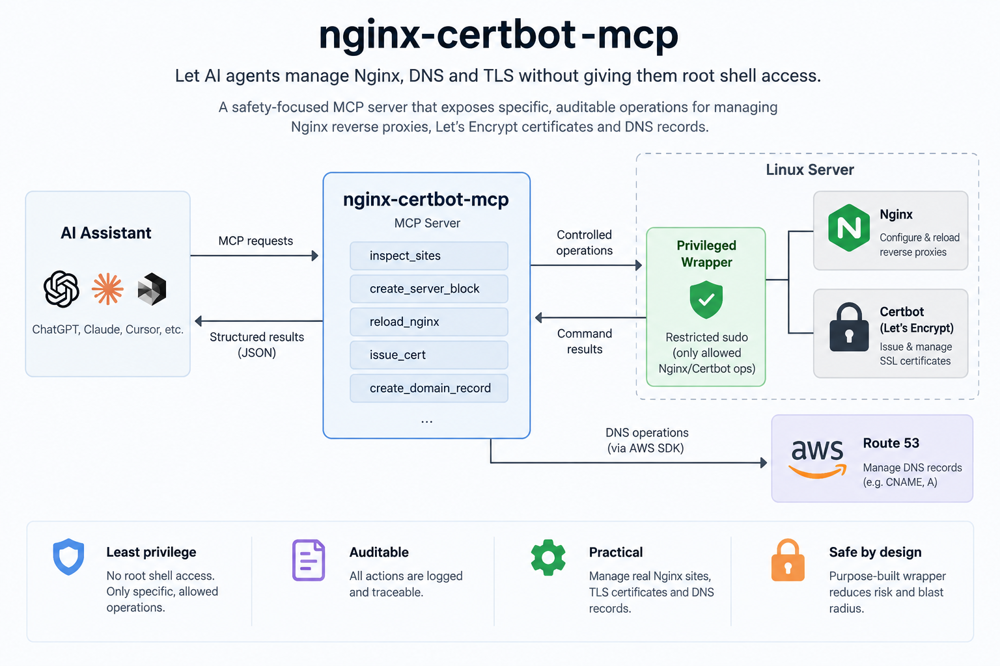
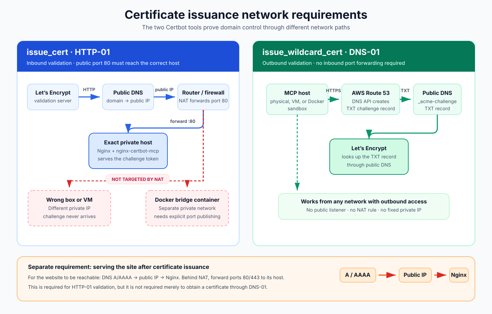

# nginx-certbot-mcp

Let AI agents manage production web infrastructure without giving them root shell access.

nginx-certbot-mcp provisions Nginx reverse proxies, DNS records, and Let's
Encrypt certificates through narrowly scoped, auditable MCP tools — never
arbitrary shell commands. Privileged actions go through purpose-built
wrappers and least-privilege sudo rules (see [Why a wrapper
script](#why-a-wrapper-script-instead-of-sudo-on-teelnrm) below).

## Architecture



## Tools

All 23 are implemented and exercised against real infrastructure — see
[Testing](#testing).

| Tool | Description |
|---|---|
| `list_sites` | List configured nginx server blocks with domain, upstream, and SSL status |
| `get_site_config` | Raw nginx config for one domain |
| `check_cert_expiry` | List certbot-managed certs and days until expiry |
| `check_dns` | Resolve a domain (CNAME, then A/AAAA) against public resolvers |
| `check_upstream_health` | TCP probe of an upstream `host:port` |
| `get_nginx_status` | Whether nginx is running, plus its version |
| `tail_site_logs` | Tail access/error logs, capped at 1000 lines |
| `list_archived_sites` | List configs archived by `delete_site` |
| `create_domain_record` | Upsert a Route 53 CNAME |
| `delete_domain_record` | Delete a Route 53 CNAME — `confirm:true` |
| `create_txt_record` | Upsert a Route 53 TXT record, e.g. for ACME DNS-01 |
| `delete_txt_record` | Delete a Route 53 TXT record — `confirm:true` |
| `create_site` | Create a websocket-capable nginx server block from the default template |
| `update_site` | Rewrite an existing site's `proxy_pass` upstream in place |
| `delete_site` | Disable, archive, and delete a server block — `confirm:true` |
| `restore_site` | Re-enable a site from its newest (or a chosen) archive — `confirm:true` |
| `prune_archives` | Delete archives older than N days — `confirm:true` |
| `reload_nginx` | `nginx -t`, then reload only if it passes |
| `issue_cert` | Issue via HTTP-01 (`certbot --nginx`) — defaults to LE staging |
| `issue_wildcard_cert` | Issue `domain` + `*.domain` via DNS-01 (`certbot --dns-route53`) — defaults to LE staging |
| `renew_cert` | `certbot renew` — defaults to `--dry-run` |
| `revoke_cert` | Revoke with Let's Encrypt, leaving the files in place — `confirm:true` |
| `delete_cert` | Remove a cert's files from certbot's store — `confirm:true` |

## Setup

```bash
npm install
npm run build
npm run setup -- mcpuser
```

Run the server as a dedicated non-root user (e.g. `mcpuser`) — never as
root. `npm run setup -- <user>` (`scripts/setup.sh`) grants that user
exactly the privileges below, nothing more, and is idempotent: safe to
re-run any time, including after changing the username or pulling an
update that adds a new allowed command.

## Required permissions

`npm run setup -- <user>` installs two things:

1. **`/usr/local/bin/nginx-mcp-writesite`** — a narrow wrapper script that
   only accepts `{write|enable|disable|remove|archive|restore|remove-archive}
   <domain>` or `log {access|error} <lines>`, and only ever touches paths
   under `/etc/nginx/sites-available/`, `/etc/nginx/sites-enabled/`,
   `/etc/nginx/sites-archived/`, and the two fixed nginx log files. It
   re-validates the domain (and, for `restore`/`remove-archive`, the
   archive filename) itself, independent of the Node-side validation.
2. **`/etc/sudoers.d/nginx-mcp`** — grants `<user>` passwordless sudo on
   exactly `nginx -t`, `systemctl reload nginx`, `systemctl is-active
   --quiet nginx`, `certbot`, and the wrapper above. Nothing broader. It
   also keeps `AWS_ACCESS_KEY_ID`/`AWS_SECRET_ACCESS_KEY`/
   `AWS_DEFAULT_REGION` through sudo (which strips the environment by
   default) so `certbot --dns-route53` can see them for
   `issue_wildcard_cert`.

`issue_wildcard_cert` also needs the `certbot-dns-route53` plugin —
`npm run install:deps` installs it for you (see [Testing](#testing)).

## Why a wrapper script instead of sudo on tee/ln/rm

An earlier version granted sudo on generic file tools (`tee`, `ln`, `rm`)
so `create_site` could write into `/etc/nginx/`. That works, but it's a
wider trust boundary than the task needs: those commands can touch *any*
root-owned file on the box, not just nginx configs. If the MCP server
process were ever compromised or triggered unexpectedly, the blast radius
would be the whole filesystem.

The wrapper narrows that to one purpose-built binary that can only act on
nginx site configs, one archive at a time, or tail one of two fixed log
files — nothing else. The trade-off is one more artifact to deploy and
keep in sync with the server, in exchange for sudo that can only ever do
what this project needs.

## Network requirements for certificate issuance



`issue_cert` and `issue_wildcard_cert` prove domain ownership two
different ways, with different requirements on where the box sits on your
network:

- **`issue_cert` (HTTP-01)** — Let's Encrypt makes an inbound HTTP request
  to the domain on port 80. If you're behind a home/office router doing
  NAT, that request lands on whichever **one** private IP your
  port-forwarding rule targets. The machine running nginx (and this MCP
  server) has to be that exact machine — not just any box on your network,
  and not the Docker sandbox (a different private IP on the Docker bridge
  network). Calling it from the wrong box fails every time, since the
  challenge request never arrives.
- **`issue_wildcard_cert` (DNS-01)** — validates via a TXT record
  `certbot-dns-route53` creates in Route 53. This is outbound-only (the
  box calls the AWS API; nothing calls back in), so it has no
  port-forwarding requirement and works identically from any network,
  including the Docker sandbox.

Either way, DNS still has to point at your public IP (`create_domain_record`
handles that) — DNS and port-forwarding are two separate requirements, and
`issue_cert` needs both.

## Environment variables

| Variable | Used by | Notes |
|---|---|---|
| `AWS_ACCESS_KEY_ID` / `AWS_SECRET_ACCESS_KEY` | `create_domain_record`, `delete_domain_record`, `create_txt_record`, `issue_wildcard_cert` | Credentials for a Route-53-scoped IAM user — no other AWS permissions needed |
| `ROUTE53_HOSTED_ZONE_ID` | `create_domain_record`, `delete_domain_record`, `create_txt_record` | Find with `aws route53 list-hosted-zones-by-name --dns-name julcap.net` |
| `AWS_DEFAULT_REGION` | Same as above, plus `issue_wildcard_cert` | Optional — Route 53 is global, but the AWS SDK/boto3 still need a signing region; defaults to `us-east-1` |

## Testing

Four layers, from "needs almost nothing" to "exercises everything":

### 1. Dependencies — `npm run install:deps`

Debian/Ubuntu only, idempotent. Installs `nginx`, `certbot`,
`python3-certbot-nginx`, and `python3-certbot-dns-route53` via apt if
missing; for anything already installed, it only reports whether the
version is current, since silently upgrading a package that might be
serving traffic isn't this script's call to make. If `certbot` looks like
a **snap** install (common — certbot's own docs recommend it over apt's
often-outdated package), it also tries installing `certbot-dns-route53` as
a snap plugin, since an apt-installed plugin can be invisible to snap
certbot's isolated Python environment. That's best-effort and additive,
never a replacement for the apt package, so `issue_wildcard_cert` has a
working path either way. Also reports your Node version against the
`>=20` that `@aws-sdk/client-route-53` will eventually require.

### 2. Route 53 round trip — `npm run test:dns`

The only requirement is a working `ROUTE53_HOSTED_ZONE_ID` (+ AWS
credentials) in `.env`. It discovers your zone's own domain from the
hosted zone, creates a disposable CNAME under a random subdomain, verifies
it (directly against Route 53, and best-effort via public DNS), then
deletes it — cleanup runs even if a check in between fails, so a bad run
can't leave an orphaned record.

### 3. Docker sandbox — real nginx + certbot, disposable

```bash
cp .env.example .env   # fill in AWS credentials + hosted zone ID
docker compose up -d --build
docker compose exec sandbox npm run inspect
```

The container runs systemd as PID 1, so `sudo systemctl reload nginx` and
friends work exactly as they do in production (needs `--privileged` and a
cgroup mount, which `docker-compose.yml` already sets up). `nginx`/
`certbot`/the plugins are installed via `install-deps.sh`, and the
wrapper/sudoers via `setup.sh`, both at image build time. Tear down with
`docker compose down` — nothing persists; every rebuild is a fresh install.

### 4. Automated tool-by-tool suite

```bash
cp .env.test.example .env.test   # AWS credentials + a domain you control
npm run test:tools                # against the Docker sandbox
npm run test:tools:host           # against this machine directly
```

Drives every tool over the real stdio JSON-RPC protocol and prints
✓/✗/– per tool. `.env.test` is separate from `.env` — read on the host and
injected directly into each MCP server process the runner spawns, so the
two files never need to match. Before touching anything it verifies your
AWS credentials work and that `TEST_DOMAIN` is the zone's apex or a
subdomain of it. Everything then runs under a random
`mcp-test-<random>.<TEST_DOMAIN>` subdomain, self-cleans after each phase,
and does a final best-effort cleanup regardless of pass/fail. Certificate
issuance is opt-in — asked interactively, or pass `--certs` for a
non-interactive run — since it hits real Let's Encrypt staging and adds a
minute or two.

The two targets differ in exactly one way, `issue_cert`:

- **`npm run test:tools`** (default) runs in the Docker sandbox, which
  isn't reachable from the internet, so `issue_cert` (HTTP-01) is always
  skipped — the cert scenario only exercises `issue_wildcard_cert`
  (DNS-01) and the renew/revoke/delete chain built on it.
- **`npm run test:tools:host`** runs `node dist/index.js` directly on this
  machine. If this is the box your router actually forwards 80/443 to,
  the cert scenario tests `issue_cert` too (waiting up to 300s for the
  disposable CNAME to propagate first), and the renew/revoke/delete chain
  runs against *that* cert instead. It refuses to start unless
  passwordless sudo already works for the current user — i.e.
  `npm run setup -- <user>` was run for the user actually invoking it, not
  some other account. **Everything this touches is real production
  state**, not a sandbox.

## Connecting a client

**MCP Inspector** — the fastest feedback loop for poking at a tool
directly:

```bash
npm run inspect
```

Prints a URL with a session token. Run it against a real box, or the
Docker sandbox (`docker compose exec sandbox npm run inspect`).

**Claude Desktop / claude.ai** — add to your MCP client config:

```json
{
  "mcpServers": {
    "nginx-certbot": {
      "command": "node",
      "args": ["/absolute/path/to/nginx-certbot-mcp/dist/index.js"]
    }
  }
}
```

Or against the running Docker sandbox:

```json
{
  "mcpServers": {
    "nginx-certbot-sandbox": {
      "command": "docker",
      "args": ["exec", "-i", "nginx-certbot-mcp-sandbox", "node", "dist/index.js"]
    }
  }
}
```

## Typical "add a new site" flow

1. `create_domain_record` — point `mysite.julcap.net` at `www.julcap.net`
2. (wait for DNS propagation)
3. `create_site` — nginx serves the domain on port 80, reverse-proxied to
   the local service IP:port
4. `reload_nginx`
5. `issue_cert` — certbot validates via HTTP-01, updates nginx to redirect
   to 443

## Contributing

Contributions are welcome. See [CONTRIBUTING.md](CONTRIBUTING.md) for
guidelines.

## License

nginx-certbot-mcp is source-available under the [Elastic License
2.0](LICENSE). You may use, modify, and redistribute the software.
However, you may not provide a substantial portion of its functionality
to third parties as a hosted or managed service.

For commercial licensing or partnership enquiries, contact the maintainer.
